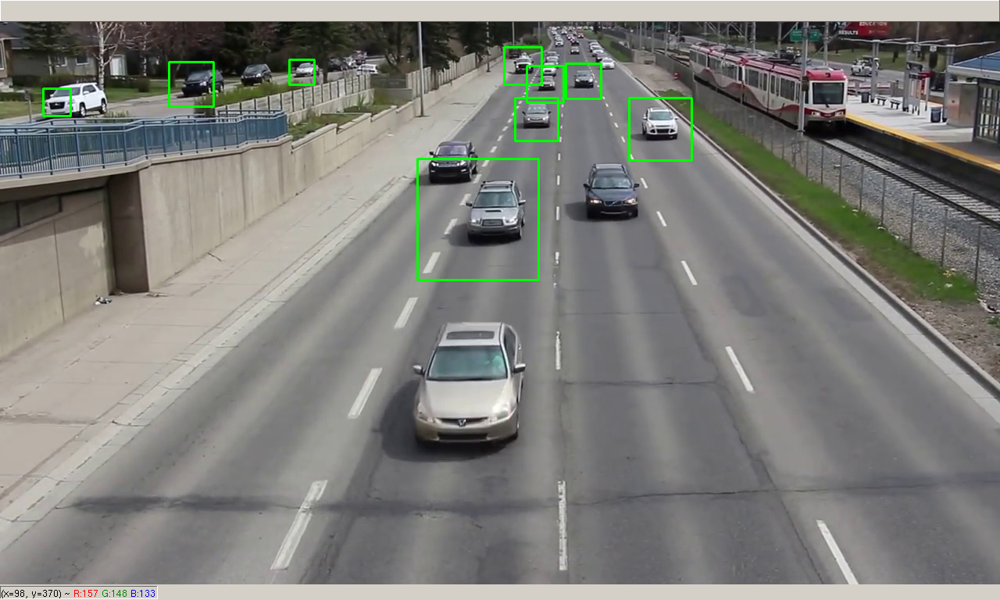

<samp>
    
# [Real-time-Vehicle-Dection-Python](https://kalebujordan.dev/real-time-vehicle-detection-using-python/)

Hi guys, This repository consist of a source code of script to detect cars in a video/camera frame and then draw rectangaluar boxes around them.

The **ML algorithms** used for detecting cars and bounding boxes coordinates is a pretrained cascade model [Haarcascade car](originhttps://github.com/NeeleshKumar0892/Real-time-vehicle-detection.git)

## Getting started

Firstly we have to clone the project repository or download the zip of project and then extract it.

```bash
git clone https://github.com/Kalebu/Real-time-Vehicle-Dection-Python
cd Real-time-Vehicle-Dection-Python
Real-time-Vehicle-Dection-Python ->
```

## Dependencies

Now once we have the project repo in our local directory, now lets install the dependecies required to run our script

```bash
pip install opencv-python
```

## **[](./pictures/rocket.png) running our script**

Now you can launch your scripts;

```bash
python app.py 
```

If you use the provided sample video, your script is going to look as shown in the picture below;



## Issues ?

Are you facing any issue while trying to run the script, well then raise an issue and I will do my best fixing it as soon as I can

